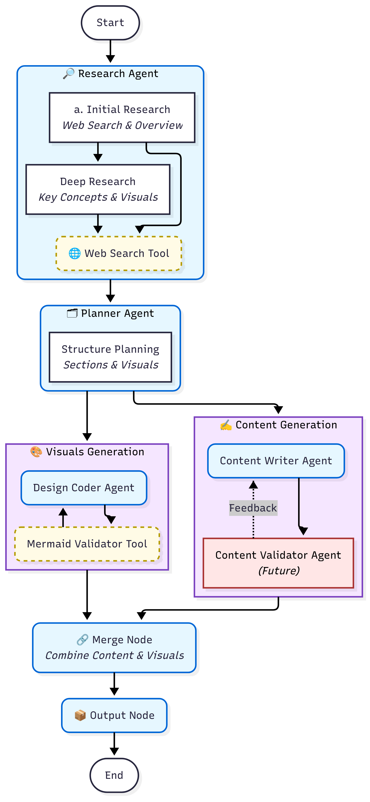

## 🚀 Project Title: **LearnMate: Visual Wiki Generator**

### 🎯 Goal

Build a multi-agent system that **generates comprehensive, visually structured wikis** on a## 🌐 Frontend Inte# Frontend Integration - Future Enhancements

Additional integration points planned for future iterations:

1. **Interactive Feedback**
   - User feedback collection
   - Wiki content editing capabilities
   - Interactive visual adjustments

2. **Enhanced Output**
   - DALL·E image integration
   - Expandable content sections
   - Optional audio support (TTS)

For complete frontend specifications, see `documentation/streamlit_ui_design.md`.

The backend system interfaces with a Streamlit frontend through these key touchpoints:

1. **Input Interface**
   - Topic input reception
   - State file handling for resumption
   - Generation trigger events

2. **Output Interface**
   - Markdown content delivery
   - Mermaid diagram code output
   - State file generation for checkpointing

3. **Error Interface**
   - Structured error information
   - Progress status updates
   - Validation feedback

For detailed frontend implementation, refer to `documentation/streamlit_ui_design.md`.

---

### 🧠 User Persona

A student/professional/enthusiast who:

- Wants a fast but comprehensive grasp of a topic
- Prefers **visually enhanced** content (diagrams, tables, flowcharts)
- Values clear, structured explanations
- Appreciates well-organized information

---

## 🔧 Multi-Agent Architecture



### 1. **Research Agent**

- **Input**: Topic from user
- **Functions** (Two-Phase Research):
  - **Initial Research Phase**:
    - Performs initial web search for overview
    - Identifies topic category and key concepts
    - Creates initial summary
    - Gathers reliable source URLs
  - **Deep Research Phase**:
    - Conducts detailed research on each key concept
    - Extracts comprehensive subtopics
    - Identifies visualization opportunities
    - Builds upon initial research findings
- **Output**:
  - Initial Research: Title, topic, category, summary, key concepts, sources
  - Deep Research: Detailed subtopics, visual suggestions

### 2. **Planner Agent**

- **Input**: Deep research results (subtopics and visual suggestions)
- **Functions**:
  - Creates logical content structure with H1/H2 headers
  - Plans section layout and flow
  - Designs comprehensive section structure
  - Maps visual suggestions to specific sections
  - Specifies visual types (mermaid_diagram, table, image)
- **Output**:
  - Title (H1)
  - Structured sections list
  - Each section includes:
    - Title (H2)
    - Content description
    - Planned visuals with types and descriptions

### 3a. **Content Writer Agent** _(Parallel Path 1)_

- **Input**: Complete structure plan from Planner
- **Functions**:
  - Single LLM call for entire content generation
  - Creates structured text content for all sections
  - Maintains section hierarchy and order
  - Excludes all visual elements
  - Ensures content aligns with planned structure
- **Output**:
  - Wiki title
  - Ordered list of sections with:
    - Section title (matching plan)
    - Full markdown content (text-only)

### 3b. **Design Coder Agent** _(Parallel Path 2)_

- **Input**: Structure plan with visual requirements
- **Functions**:
  - Generates actual visual implementations
  - Creates Mermaid diagrams with proper syntax
  - Formats tables in markdown
  - Handles image references
  - Uses double quotes for Mermaid labels
- **Output**:
  - Title (matching plan)
  - Sections list with:
    - Section title
    - List of visuals including:
      - Visual title
      - Visual type
      - Generated code/content
      - Image paths (if applicable)

### 4. **Future Validation Layer** _(Planned)_

#### Content Validator

- **Status**: Not yet implemented
- **Purpose**: Ensure content quality and accuracy
- **Planned Features**:
  - Content accuracy verification
  - Completeness checks
  - Clarity assessment
  - Feedback loop to Content Writer

#### Mermaid Validator

- **Status**: Basic structure in place
- **Purpose**: Ensure visual element validity
- **Current Features**:
  - Basic syntax validation structure
- **Planned Features**:
  - Full syntax validation
  - Visual clarity checks
  - Diagram effectiveness assessment
  - Feedback loop to Design Coder

### State Management & Checkpointing

The system uses an advanced state management system with automatic checkpointing:

1. **State Storage**
   - All state stored using basic Python types (dict, list, str, etc.)
   - Pydantic models used only for validation during agent calls
   - Automatic JSON serialization for checkpoints
   - State saved after each successful node execution

2. **State Components**
   - `user_input`: Initial topic from user
   - `initial_research`: Basic topic research
   - `deep_research`: Detailed concept exploration
   - `structure_plan`: Content and visual planning
   - `wiki_content`: Generated textual content
   - `design_code`: Generated visual elements
   - `final_wiki_path`: Path to merged output
   - Additional metadata (user preferences, retry count, etc.)

3. **Checkpoint Mechanism**
   - Location: `outputs/[Topic_Name]/saved_wiki_state.json`
   - Updated after each successful node execution
   - Preserves state even if execution is interrupted
   - Enables resumption from last successful node (basically any saved state file) via `--state` argument
   - Console progress updates for monitoring
   - Usage: `python backend/main.py --state outputs/Your_Topic/saved_wiki_state.json`

4. **State Flow & Dependencies**
   - Ordered mapping of state keys to nodes
   - Sequential dependency chain:

     ```
     user_input → initial_research → deep_research 
    
                         ┌─ wiki_content ─┐
     → structure_plan →  |                |  → final_wiki_path
                         └─ design_code ──┘
     ```

   - Each state key requires all previous keys in the chain
   - Manual state edits must preserve this dependency order
   - Automatic state inspection and saving
   - Recovery from interruptions at any node

### Parallel Processing

Content generation and visual design run in parallel for efficiency

---

## 🌐 User Interface: **Streamlit Frontend** (Planned for Future)

### 📌 Layout Overview

| UI Section                 | Function                                                 |
| -------------------------- | -------------------------------------------------------- |
| **Topic Input Box**        | User enters any topic (e.g., “How DNS Works”)            |
| **“Generate Wiki” Button** | Triggers the agent pipeline                              |
| **Generated Wiki Viewer**  | Displays structured output with expandable sections      |
| **Diagrams & Images**      | Renders inline visuals using DALL·E or Mermaid           |
| **Feedback Box**           | User gives optional feedback to edit the generated wiki  |

### Streamlit Features Used

- `st.chat_message` for Tutor interaction
- `st.expander` for collapsible content sections
- `st.image` for visual rendering
- `st.session_state` for progress tracking
- (Optional) Audio using `st.audio` if TTS is enabled

---

## ✅ MVP

- Topic Input → Generates a visual wiki with at least 5-6 sections in detail
- At least 3-4 visuals (Mermaid diagram, table or image) throughout
- Streamlit UI showing:  
  - Wiki content with expandable sections
  - Visuals with Mermaid diagrams
- No user login/auth or persistence needed

---

## ✨ Optional Enhancements (Stretch Goals)

| Feature                       | Value                                      |
| ---------------------------- | ------------------------------------------ |
| Export Wiki as PDF           | Easy sharing and offline access            |
| Multiple diagram styles      | Support for more visual formats            |
| Custom diagram themes        | Consistent visual styling                  |
| LLM-RAG integration          | Better content grounding via external PDFs |

---

## 🧪 Example Topics to Try

-   "Intro to Kafka & Event Streaming"
-   "How Git Internally Works"
-   "Basics of Prompt Engineering"
-   "Data Warehousing vs Data Lakes"

---

## 📂 Project Folder Structure

```
learnmate/
├── LICENSE                     # Project license
├── pyproject.toml             # Python packaging and dependency configuration
├── uv.lock                    # Dependency lock file
├── wiki_creation_graph.png    # Current graph visualization
├── README.md                  # Project overview
├── backend/                   # Main application and supporting modules
│   ├── __init__.py           # Package initialization
│   ├── llm.py                # LLM configuration and setup
│   ├── main.py               # Core pipeline implementation
│   ├── paths.py              # Path configuration
│   ├── prompt_builder.py     # Prompt construction utilities
│   └── utils.py              # Shared utilities
├── config/                    # Configuration files
│   ├── config.yaml           # System configuration
│   └── prompt_config.yaml    # Agent prompts and templates
├── documentation/            # Project documentation
│   ├── design.md            # Architecture and design documentation
│   ├── streamlit_ui_design.md # UI design specifications
│   ├── multi_agent_design_flowchart.mmd # Architecture diagram source
│   └── multi_agent_design_flowchart.png # Rendered architecture diagram
├── frontend/                 # Streamlit web interface
│   ├── app.py               # Main Streamlit application
│   ├── components/          # UI components
│   │   ├── sidebar.py      # Sidebar implementation
│   │   └── wiki_viewer.py  # Wiki content display
│   └── utils/              # Frontend utilities
│       └── state.py        # Session state management
└── outputs/                 # Generated wiki content
    └── [Topic_Name]/       # Topic-specific outputs
        ├── complete_wiki.md # Final merged wiki content
        └── saved_wiki_state.json # Serialized state for resumption
```

---

## 🏃 Usage

### Prerequisites

- Python 3.x installed as per `pyproject.toml`
- Dependencies installed using your preferred package manager (`uv` is recommended - `uv sync` or `pip install -r requirements.txt`
- Environment variables set (if required)

### Running the Wiki Generator

From the repository root:

```bash
python backend/main.py
```

This starts the CLI-based wiki generation pipeline.

### Runtime State Management

- Each run creates a `saved_wiki_state.json` in the topic's output directory
- State includes:
  - Research findings
  - Generated content
  - Visual elements
  - Progress tracking
- To resume from a checkpoint:
  1. Locate the saved state JSON
  2. Run with `--state` argument: `python backend/main.py --state outputs/Your_Topic/saved_wiki_state.json`

### Configuration

- System settings: `config/config.yaml`
- Agent prompts: `config/prompt_config.yaml`
- All settings can be adjusted before running

### Output Structure

- Generated content goes to `outputs/[Topic_Name]/`
- Files created:
  - `complete_wiki.md`: Final merged wiki
  - `saved_wiki_state.json`: Checkpoint data
  
### Notes

- CLI interface only (Streamlit UI planned)
- Uses LangGraph for state management
- Supports parallel content/visual generation
