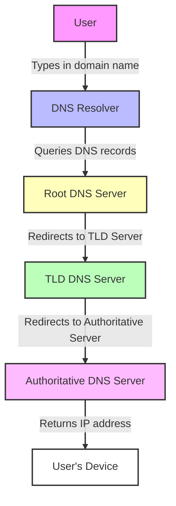

# Understanding the Domain Name System (DNS)

## Overview of the Domain Name System (DNS)

The Domain Name System (DNS) is a fundamental component of the internet, serving as a hierarchical naming system that translates human-readable domain names into machine-readable IP addresses. This translation is crucial because, while we prefer to use easy-to-remember names like `www.example.com`, computers and servers communicate using numerical IP addresses such as `192.0.2.1`.

### The Structure of DNS

DNS operates through a structured hierarchy, which can be visualized as a tree:

- **Root Level**: At the top of the hierarchy is the root domain, represented by a dot (.). This level contains the DNS servers that manage the top-level domains (TLDs).
- **Top-Level Domains (TLDs)**: These are the suffixes of domain names, such as `.com`, `.org`, and `.net`. Each TLD is managed by a specific organization and has its own set of authoritative DNS servers.
- **Second-Level Domains**: Below the TLDs, we find second-level domains, which are often the names of organizations or entities, like `example` in `example.com`.
- **Subdomains**: These are additional divisions of a domain, such as `www` in `www.example.com`, which can point to different servers or services.

### Components of DNS

DNS consists of several key components:

- **DNS Records**: These are entries in the DNS database that provide information about a domain. Common types of DNS records include:
  - **A Record**: Maps a domain to an IPv4 address.
  - **AAAA Record**: Maps a domain to an IPv6 address.
  - **CNAME Record**: Allows a domain to alias another domain.
  - **MX Record**: Specifies mail servers for a domain.

- **DNS Resolvers**: These are servers that receive queries from clients (like your computer) and are responsible for finding the corresponding IP address by querying other DNS servers.

- **Authoritative Name Servers**: These servers hold the DNS records for a domain and provide answers to queries about that domain.

### The Role of DNS in Internet Functionality

DNS is often likened to a digital phone book. Just as a phone book helps you find a person's phone number based on their name, DNS helps users access websites by translating domain names into IP addresses. Without DNS, we would have to remember complex numerical addresses for every website we want to visit, which would be impractical and cumbersome.

### Importance of DNS in Everyday Internet Use

The DNS system is critical for the functionality of the internet. It enables seamless navigation, allowing users to access websites, send emails, and utilize online services without needing to understand the underlying IP addresses. Furthermore, DNS contributes to the overall user experience by providing a level of abstraction that simplifies internet usage.

In summary, understanding the Domain Name System is essential for grasping how the internet operates. It not only facilitates user access to websites but also plays a vital role in the broader ecosystem of internet functionality.

