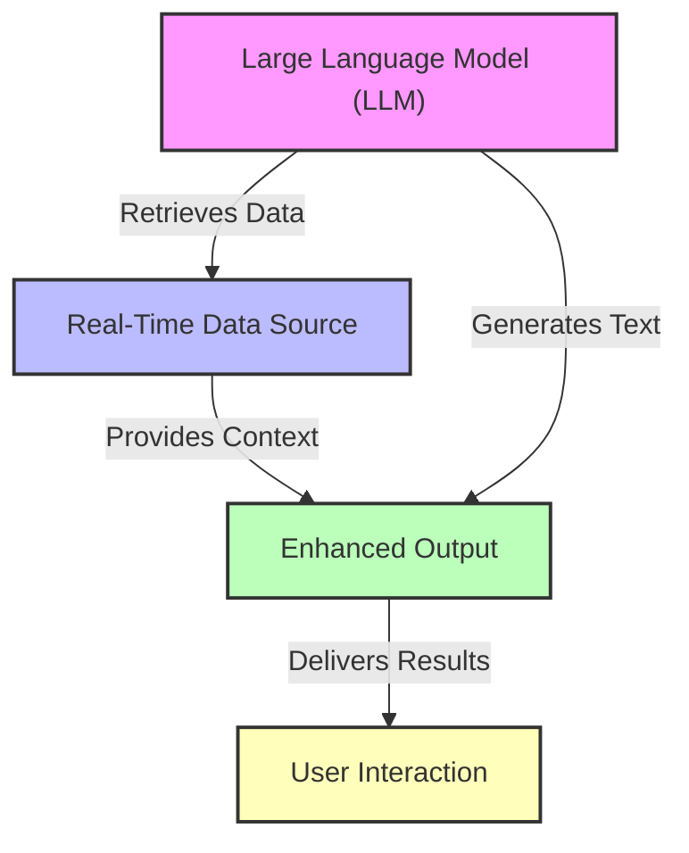

# Understanding Retrieval-Augmented Generation (RAG)

## Introduction to Retrieval-Augmented Generation (RAG)

Retrieval-Augmented Generation (RAG) is an innovative approach that combines the strengths of large language models (LLMs) with the ability to access and utilize real-time data from external sources. This integration allows RAG systems to generate more accurate and contextually relevant responses by retrieving information dynamically during the generation process.

### Purpose and Significance of RAG

The primary purpose of RAG is to enhance the capabilities of traditional generative models, which often rely solely on the data they were trained on. By incorporating retrieval mechanisms, RAG can:

- **Access Up-to-Date Information**: Unlike static models, RAG can pull in the latest data, making it particularly useful for applications that require current knowledge, such as news summarization or customer support.
- **Improve Accuracy and Relevance**: By retrieving specific data points relevant to the query, RAG can produce responses that are not only more accurate but also tailored to the user's needs.
- **Reduce Hallucination**: Traditional LLMs sometimes generate plausible-sounding but incorrect information (a phenomenon known as hallucination). RAG mitigates this risk by grounding its outputs in actual retrieved content.

### Basic Principles of RAG

At its core, RAG operates on two main components:

1. **Retrieval Component**: This part of the system is responsible for searching and retrieving relevant documents or data from a predefined database or the internet. It employs various techniques, such as keyword matching and semantic search, to find the most pertinent information.
2. **Generation Component**: Once the relevant data is retrieved, the generation component, typically a large language model, processes this information to create coherent and contextually appropriate responses. This model is trained to understand how to incorporate the retrieved data into its outputs effectively.

### Architecture of RAG

The architecture of RAG can be visualized as a two-step process:

1. **Querying**: When a user inputs a query, the retrieval component first analyzes the request and searches for relevant documents.
2. **Response Generation**: After retrieving the documents, the generation component synthesizes this information to formulate a response that integrates both the user's query and the retrieved content.

### Advantages Over Traditional Generative Models

RAG offers several advantages compared to traditional generative models:

- **Enhanced Contextual Understanding**: By leveraging real-time data, RAG can provide contextually rich responses that reflect the latest information.
- **Scalability**: RAG systems can scale their knowledge base by simply updating the retrieval database, rather than requiring retraining of the entire model.
- **Versatility**: RAG can be applied across various domains, from customer service to academic research, making it a versatile tool in the AI landscape.

In summary, Retrieval-Augmented Generation represents a significant advancement in the field of natural language processing. By merging the capabilities of LLMs with dynamic data retrieval, RAG not only enhances the quality of generated content but also opens up new possibilities for real-time applications. This foundational understanding sets the stage for a deeper exploration of RAG's components and its practical applications in various fields.

